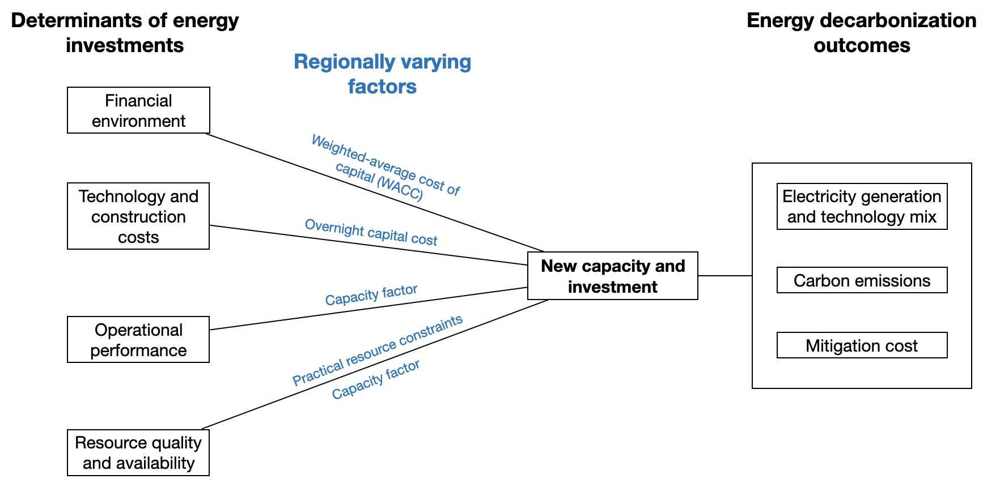
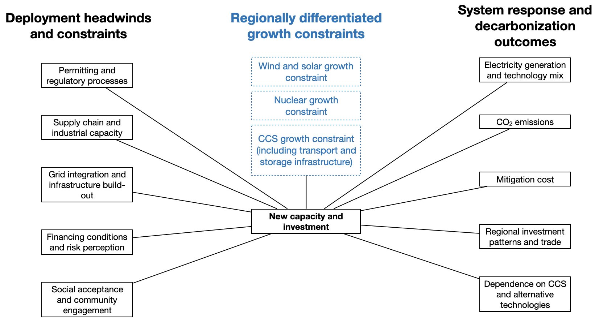

---
title: "Research"
toc: false
---

## Regional Variation in Energy Investment

### Improving the Representation of Regional Variation in Energy Investments for More Realistic Modeling of Global Decarbonization Pathways

Integrated assessment models often rely on technology assumptions that mask important regional differences in investment conditions. In this project, we update GCAM assumptions for 32 world regions and seven low-carbon technologies to better reflect variation in financing conditions, technology and construction costs, operational performance, and resource availability.

By incorporating these regional differences systematically, this work examines how local investment conditions reshape technology deployment, alter mitigation costs, and change the allocation of global decarbonization efforts.

{width=70%}

Conceptual framework linking regionally varying investment conditions to energy investment and decarbonization outcomes.

## Carbon Storage Bottlenecks and Deep Decarbonization

### Carbon Storage Bottlenecks Reshape Modeled Deep Decarbonization Pathways

Deep decarbonization scenarios often rely on rapid expansion of low-carbon technologies, including wind, solar, nuclear power, and carbon capture and storage (CCS). Yet these technologies cannot necessarily scale as quickly as unconstrained model projections imply. Their deployment can be limited by infrastructure development, permitting, supply chains, financing, grid integration, and other institutional and physical constraints.

In this project, we incorporate regionally differentiated deployment growth constraints for wind, solar, and CCS into GCAM to examine how technology speed limits reshape global decarbonization pathways. Attribution scenarios are used to identify which constraints matter most and how their effects differ across regions.

A central focus is CCS. Because CCS deployment depends not only on capture technology, but also on CO₂ transport networks, storage characterization, injection capacity, regulation, and infrastructure development, limits on the pace of CCS expansion can have system-wide consequences. The analysis examines how constrained CCS deployment changes technology substitution, regional investment patterns, mitigation costs, and the broader allocation of mitigation efforts.

{width=78%}

Conceptual framework linking deployment headwinds and regionally differentiated technology growth constraints to energy investment decisions and decarbonization outcomes.

We also compare constrained CCS deployment with scenarios assessed in the IPCC Sixth Assessment Report to evaluate how strongly existing mitigation pathways depend on rapid CCS scale-up, particularly in regions where current deployment remains limited.